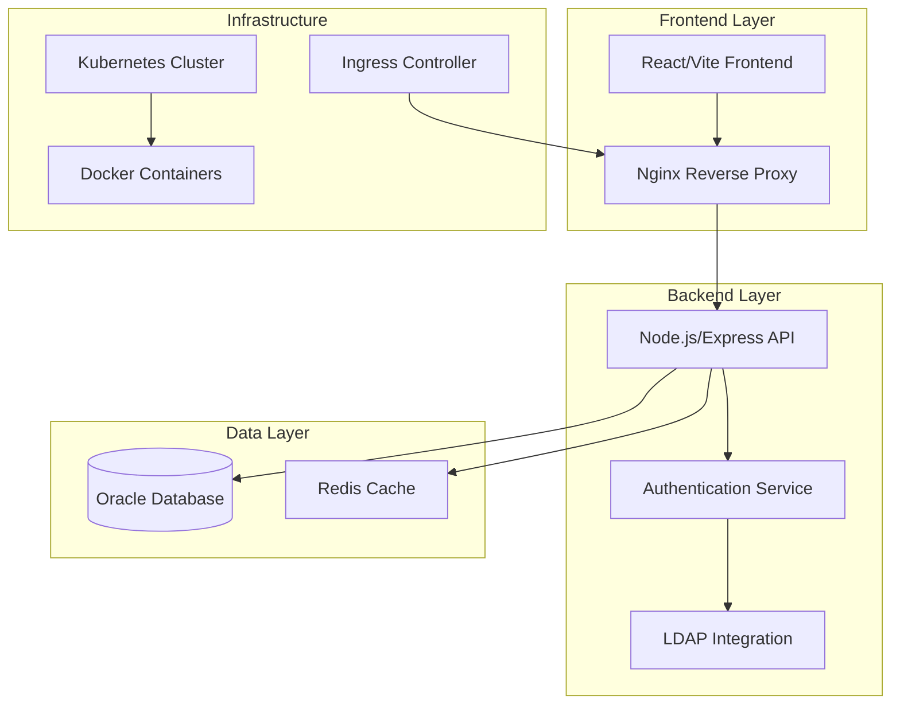
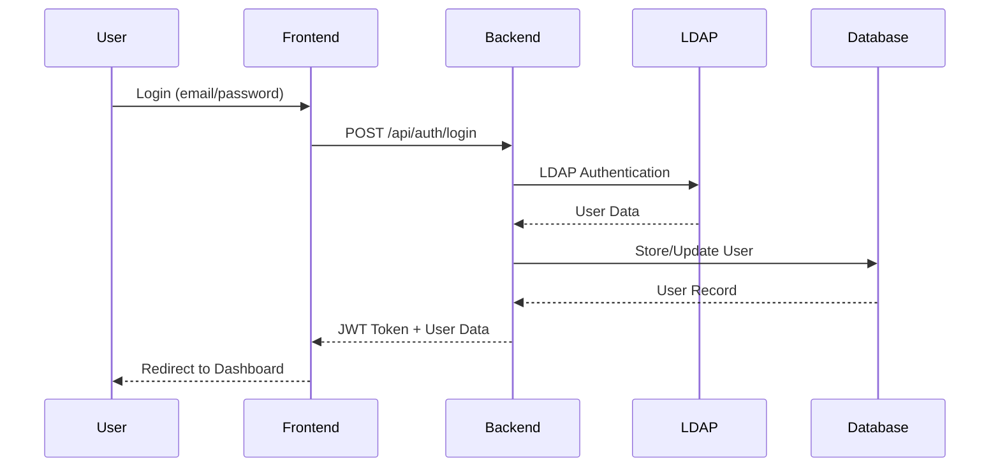
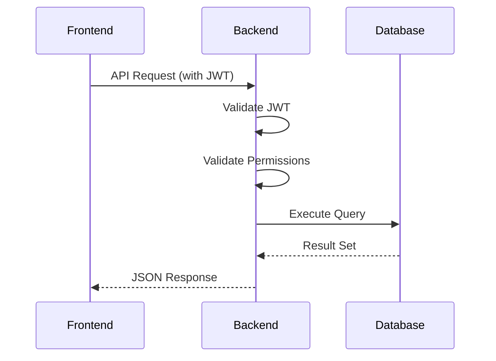
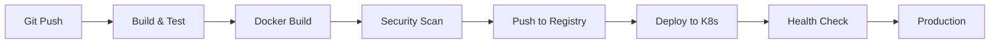

# Arquitetura do Sistema NovoProtocolo

## 🏗️ Visão Geral da Arquitetura

O sistema NovoProtocolo é uma aplicação web moderna construída com arquitetura de microserviços, containerizada com Docker e orquestrada com Kubernetes.

### Componentes Principais



## 🎯 Arquitetura de Deployment

### Ambiente Local (Docker Compose)
```yaml
version: '3.8'
services:
  frontend:
    build: .
    ports: ["8080:8080"]
    depends_on: [backend]
    
  backend:
    build: ./backend
    ports: ["3001:3001"]
    depends_on: [oracle-db]
    
  oracle-db:
    image: container-registry.oracle.com/database/free:latest
    ports: ["1521:1521", "5500:5500"]
```

### Ambiente Kubernetes
```yaml
# Namespace: novoprotocolo
# Components:
# - Frontend Deployment (3 replicas)
# - Backend Deployment (2-10 replicas with HPA)
# - Oracle Database (1 replica with PVC)
# - Ingress (nginx-ingress)
# - ConfigMaps & Secrets
```

## 🔧 Stack Tecnológico

### Frontend
- **Framework**: React 18 com TypeScript
- **Build Tool**: Vite
- **UI Library**: Radix UI + Tailwind CSS
- **State Management**: React Query (TanStack Query)
- **Routing**: React Router DOM
- **HTTP Client**: Axios

### Backend
- **Runtime**: Node.js 18
- **Framework**: Express.js
- **Language**: TypeScript
- **ORM**: Custom Oracle integration
- **Authentication**: JWT + LDAP
- **Validation**: Joi/Zod
- **Logging**: Winston

### Database
- **Primary**: Oracle Database Free 23c
- **Schema**: protocolo_user
- **Connection**: Oracle Instant Client
- **Backup**: Oracle Data Pump

### Infrastructure
- **Containerization**: Docker
- **Orchestration**: Kubernetes
- **Reverse Proxy**: Nginx
- **Ingress**: nginx-ingress-controller
- **SSL/TLS**: cert-manager + Let's Encrypt

## 📊 Fluxo de Dados

### Autenticação


### Operações CRUD


## 🔐 Segurança

### Camadas de Segurança

1. **Network Security**
   - Kubernetes Network Policies
   - Ingress TLS/SSL
   - Internal service communication

2. **Application Security**
   - JWT Authentication
   - RBAC (Role-Based Access Control)
   - Input validation
   - SQL injection prevention

3. **Infrastructure Security**
   - Container security scanning
   - Secrets management
   - Non-root containers
   - Resource limits

### Autenticação e Autorização
```typescript
// JWT Token Structure
interface JWTPayload {
  userId: string;
  email: string;
  roles: string[];
  permissions: string[];
  exp: number;
  iat: number;
}

// RBAC Implementation
const permissions = {
  'admin': ['*'],
  'user': ['read:own', 'write:own'],
  'viewer': ['read:own']
};
```

## 📈 Escalabilidade

### Horizontal Scaling
- **Frontend**: Stateless, pode escalar infinitamente
- **Backend**: Stateless com HPA baseado em CPU/Memory
- **Database**: Single instance com backup/recovery

### Performance Optimizations
- **Frontend**: Code splitting, lazy loading, CDN
- **Backend**: Connection pooling, caching, compression
- **Database**: Indexes, query optimization, partitioning

### Monitoring e Observabilidade
```yaml
# Métricas importantes
metrics:
  - name: http_requests_total
    type: counter
  - name: http_request_duration_seconds
    type: histogram
  - name: database_connections_active
    type: gauge
  - name: memory_usage_bytes
    type: gauge
```

## 🔄 CI/CD Pipeline

### Fluxo de Deploy


### Ambientes
1. **Development**: Local Docker Compose
2. **Staging**: Kubernetes cluster (staging namespace)
3. **Production**: Kubernetes cluster (production namespace)

## 🗄️ Modelo de Dados

### Principais Entidades
```sql
-- Usuários
CREATE TABLE usuarios (
    id NUMBER PRIMARY KEY,
    email VARCHAR2(255) UNIQUE NOT NULL,
    nome VARCHAR2(255) NOT NULL,
    setor_id NUMBER REFERENCES setores(id),
    ativo CHAR(1) DEFAULT 'S',
    created_at TIMESTAMP DEFAULT CURRENT_TIMESTAMP
);

-- Setores
CREATE TABLE setores (
    id NUMBER PRIMARY KEY,
    nome VARCHAR2(255) NOT NULL,
    codigo VARCHAR2(50) UNIQUE,
    hierarquia VARCHAR2(500),
    ativo CHAR(1) DEFAULT 'S'
);

-- Protocolos
CREATE TABLE protocolos (
    id NUMBER PRIMARY KEY,
    numero VARCHAR2(50) UNIQUE NOT NULL,
    assunto VARCHAR2(500) NOT NULL,
    usuario_id NUMBER REFERENCES usuarios(id),
    setor_origem_id NUMBER REFERENCES setores(id),
    setor_destino_id NUMBER REFERENCES setores(id),
    status VARCHAR2(50) DEFAULT 'ABERTO',
    created_at TIMESTAMP DEFAULT CURRENT_TIMESTAMP
);
```

### Relacionamentos
- Usuário pertence a um Setor
- Protocolo tem Usuário criador
- Protocolo tem Setor origem e destino
- Setor tem hierarquia (self-reference)

## 🚀 Deployment Strategies

### Rolling Update (Padrão)
- Zero downtime
- Gradual replacement
- Rollback automático em caso de falha

### Blue-Green Deployment
- Ambiente completo duplicado
- Switch instantâneo
- Rollback imediato

### Canary Deployment
- Deploy gradual por percentual
- Monitoramento de métricas
- Rollback baseado em thresholds

## 📋 Configurações por Ambiente

### Development
```yaml
replicas: 1
resources:
  requests: { cpu: 100m, memory: 128Mi }
  limits: { cpu: 500m, memory: 512Mi }
debug: true
logLevel: debug
```

### Staging
```yaml
replicas: 2
resources:
  requests: { cpu: 200m, memory: 256Mi }
  limits: { cpu: 1000m, memory: 1Gi }
debug: false
logLevel: info
```

### Production
```yaml
replicas: 5
resources:
  requests: { cpu: 500m, memory: 512Mi }
  limits: { cpu: 2000m, memory: 2Gi }
debug: false
logLevel: warn
hpa:
  minReplicas: 5
  maxReplicas: 20
```

## 🔍 Monitoramento

### Health Checks
- **Liveness Probe**: Verifica se o container está vivo
- **Readiness Probe**: Verifica se está pronto para receber tráfego
- **Startup Probe**: Verifica inicialização lenta

### Métricas de Negócio
- Número de protocolos criados por dia
- Tempo médio de processamento
- Taxa de erro por endpoint
- Usuários ativos por período

### Alertas
- CPU > 80% por 5 minutos
- Memory > 90% por 2 minutos
- Error rate > 5% por 1 minuto
- Response time > 2 segundos

## 🔧 Manutenção

### Backup Strategy
- **Database**: Daily full backup + transaction log backup
- **Files**: Persistent volumes backup
- **Configuration**: Git repository backup

### Disaster Recovery
- **RTO**: Recovery Time Objective < 4 horas
- **RPO**: Recovery Point Objective < 1 hora
- **Backup Retention**: 30 dias local, 1 ano remoto

### Updates e Patches
- **Security patches**: Imediato
- **Minor updates**: Mensal
- **Major updates**: Trimestral
- **Database updates**: Semestral

---

**Última atualização**: Outubro 2024  
**Versão**: 1.0.0